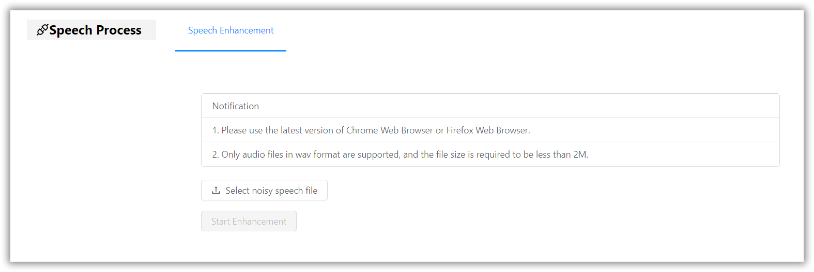

**Under Construction...**

This project is a demonstration of the paper *UNetGAN: A Robust Speech Enhancement Approach in Time Domain for Extremely Low Signal-to-noise Ratio Condition*.

## Usage

Visit this link to enter the demo page. You can select the noisy speech by clicking the button "select noisy speech" and click the "Start enhancement" button to upload the noisy speech to our model. 

After the model denoises the speech, the button "Download enhanced speech" will appear on the page. You can click this button to download the enhanced speech.

#### Note

1. Only upload voice files of 2MB or less, wav format. The recommended sampling rate is 16000Hz.
2. Please use the latest version of modern browsers, such as the latest version of [Google Chrome](https://www.google.com/chrome/), [Firefox](https://www.mozilla.org/en-US/firefox/new/).

## Model featrues

The model has been described in detail in the paper, and only some of the features of the model are emphasized here.

### Training dataset

The [TIMIT](https://catalog.ldc.upenn.edu/LDC93S1) and [NOISEX-92](http://spib.linse.ufsc.br/noise.html) corpus are used in the experiment.
The TIMIT corpus is used as the clean database and the NOISEX-92 corpus is used as interference.
We randomly selected 750 utterances from the TIMIT and divided them into three parts: the training part (600 utterances), the validation part (50 utterances) and the test part (100 utterances).
With respect to the training set, we selected babble, factoryfloor1, destroyerengine and destroyerops from NOISEX-92 corpus.
The first 2 minutes of each noise are mixed with the clean speech in the training part at one of 4 SNRs (0dB, -5dB, -10dB, -15dB).
In total, this yields 9600 training samples, each of which consists of a mixture and its corresponding clean speech.
Beside the noises in the training set, we selected factoryfloor2 (from NOISEX-92 corpus) to evaluate generalization performance.
The last 2 minutes of each noise are mixed with the test utterances at one of 9 SNRs (0dB, -3dB, -5dB, -7dB, -10dB, -12dB, -15dB, -17dB, -20dB), resulting in 4500 test samples.
The validation set is built in the same way as the test set, which includes 2250 samples.
The sampling rate of all samples is 16000 Hz. 
The noise is divided into two sections to ensure that the test noise is not repeated in the training set.

### Low SNR conditions

Our model performs very well at extremely low SNR conditions, including 0dB, -3dB, -5dB, -7dB, -10dB, -12dB, -15dB, -17dB and -20dB, even our model is not trained under some low SNR conditions, such as -3dB, -7dB, -12dB, -17dB and -20dB.